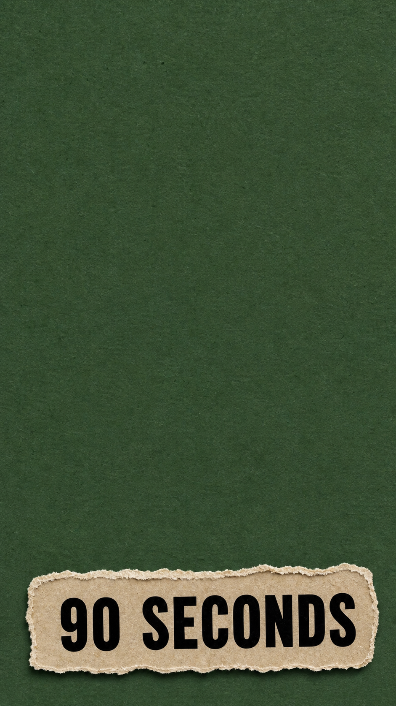
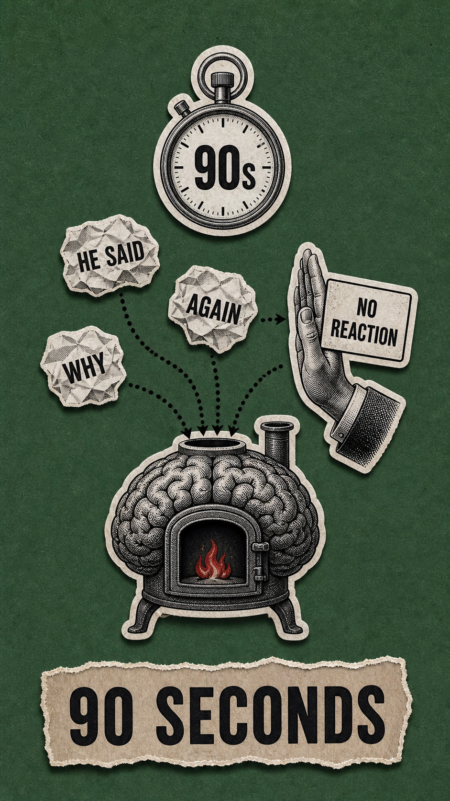
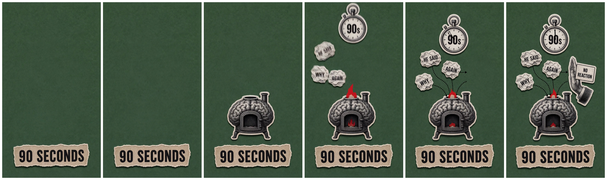

# B-roll Shot Builder

把长文案转成“首帧图片 + 尾帧图片 + 视频动画提示词”的 B-roll 制作 skill。

核心逻辑来自这种分帧方法：不要让一个完整画面一开始就动，而是先生成一个空白或稀疏的首帧，再生成一个完整尾帧，然后让视频模型按时间线把元素一下一下添加、移除或变化，最后稳定到尾帧。

## 适合做什么

- 从一段中文口播稿里选取最适合视觉化的一小段。
- 把抽象观点改写成暗喻、讽刺、文学化的画面。
- 生成 GPT / Nano Banana 可用的首帧图 prompt 和尾帧图 prompt。
- 生成 Grok / Seedance 可用的 first-tail reference-to-video 动画 prompt。
- 规划 6 秒视频里的元素入场、退出、变化、关系线变化和尾帧稳定。

## 事前声明

这个 skill 本身不包含 GPT 生图模型，也不包含 Grok / Seedance 视频模型。它负责把文案拆成可执行的生产计划和提示词。

真实生成视频需要你本地已经具备：

- Codex 可读取这个 skill。
- 可用的 GPT / Nano Banana 生图入口。
- 可用的 Grok CLI 或其他支持 image-to-video / reference-to-video 的视频工具。
- 如果用 Grok CLI，本项目默认按用户本机路径 `/Users/huangweihong/.grok/bin/grok` 和本地代理 `socks5h://127.0.0.1:10808` 编写示例命令。
- 用 ffmpeg 抽帧检查时，建议从主视频流抽尾帧，避免拿到封面图。

## 安装

把 `broll-shot-builder` 文件夹复制到 Codex skills 目录：

```bash
mkdir -p ~/.codex/skills
cp -R broll-shot-builder ~/.codex/skills/
```

之后在 Codex 里可以这样触发：

```text
使用 $broll-shot-builder，根据这段文案生成一段 B-roll。先读文案，选一小段，策划暗喻，然后写首帧 prompt、尾帧 prompt、动画 prompt，并按首尾帧方法生成视频。
```

## 请求流程

1. 读完整文案，不急着画整段。
2. 选一小段最适合视觉化的句子，优先选冲突、讽刺、转折、因果或抽象概念。
3. 判断文本情绪，再决定面板颜色。绿色只用于理性、克制、观察类内容；愤怒可以用红版，讽刺可以用黄版，官僚/强制可以用文件纸和红章。
4. 把文字转成画面暗喻：抽象观点 -> 情绪温度 -> 冲突/讽刺 -> 可见物件 -> 逐步变化。
5. 写首帧 prompt：画面必须空或稀疏，只保留背景、标题、一个锚点或留白。
6. 写尾帧 prompt：完整最终构图，所有关键元素都在。
7. 写动画 prompt：明确告诉视频模型从 image 1 走向 image 2，不要一开始显示尾帧，不要整体交叉淡入，不要整图变形。
8. 生成首帧图和尾帧图。
9. 用 Grok / Seedance 的 reference-to-video 或 first/tail frame 逻辑生成视频。
10. 抽帧检查首秒是否足够空、元素是否逐步入场、最后一秒是否接近尾帧。

## 动画节奏模板

```text
Use image 1 as the exact first frame and image 2 as the target tail frame.
Do not start from image 2. Do not crossfade. Do not morph the whole image at once.
Do not reveal the full tail composition early.

0.0-0.6s: hold image 1 nearly unchanged.
0.6-1.6s: first major sticker enters.
1.6-2.6s: primary prop group enters one by one.
2.6-3.8s: character group or secondary metaphor enters.
3.8-4.8s: icons, labels, question marks, arrows, or relationship lines enter.
4.8-5.5s: small details, shadows, and jitter settle.
5.5-6.0s: hold a stable final frame close to image 2.
```

## 示例：情绪掌控 90 秒

选取文案：

```text
愤怒这种情绪，在你全身运作大概就是九十秒。
但是你之所以一直愤怒，是因为你在不间断地想这件事情。
```

画面暗喻：

- 愤怒是一台脑炉里的小火苗。
- 反复想这件事，是不断投喂火苗的纸团燃料。
- “不做反应”是一只阻挡纸团继续投喂的手。
- “90 SECONDS” 是稳定信息锚点。

首帧：



尾帧：



生成视频：

[emotion_control_90s_first_tail.mp4](assets/examples/emotion-control-90s/emotion_control_90s_first_tail.mp4)

抽帧检查：



这个示例的结果是：开头保持空面板和 `90 SECONDS`，随后脑炉、火苗、想法纸团、秒表和 `NO REACTION` 手势逐步出现，最后稳定成尾帧。

## 脚本用法

生成可复制的 prompt 包：

```bash
python3 scripts/build_broll_plan.py \
  --concept "anger is a small flame in a brain furnace, repetitive thoughts feed it, no reaction blocks the fuel" \
  --source-text "愤怒这种情绪，在你全身运作大概就是九十秒。但是你之所以一直愤怒，是因为你在不间断地想这件事情。" \
  --excerpt "愤怒这种情绪，在你全身运作大概就是九十秒。" \
  --emotion "anger" \
  --elements "90 SECONDS label,brain furnace sticker,red flame and crumpled thought fuel,NO REACTION hand" \
  --style "darkly comic satirical editorial paper-collage animation, vintage halftone, thick white sticker outlines, readable torn-paper typography" \
  --composition "locked vertical 9:16 camera, centered paper panel, large negative space at start" \
  --text "90 SECONDS" \
  --duration 6 \
  --out ./out/emotion-control-90s
```

输出包括：

- `shot_plan.json`
- `prompts.md`
- `assemble_manifest.json`
- `cli_commands.sh`
- `grok_prompts/shot_01.md`

## 风格关键词

可以用这些词控制整体气质：

- darkly comic satirical editorial paper-collage animation
- literary satirical allegory
- Kafkaesque bureaucratic allegory
- quiet menace, ironic symbolism
- vintage halftone, risograph texture
- thick white sticker outlines
- staged sticker assembly

## 开源协议

MIT License.
