# Satirical Editorial Collage Video


把长文案转成“讽刺社论拼贴动画”风格视频的 Codex skill。

核心逻辑来自这种分帧方法：不要让一个完整画面一开始就动，而是先生成一个空白或稀疏的首帧，再生成一个完整尾帧，然后让视频模型按时间线把元素一下一下添加、移除或变化，最后稳定到尾帧。

重点不是“把观点写成文字”，而是让图片和动效承担观点。文字只作为画面里的小道具出现，比如瓶身标签、按钮字、文件章、刻度、路牌；如果把文字全部模糊掉，画面隐喻仍然应该成立。

默认工具链是：GPT / Nano Banana 生成首帧和尾帧，Grok / Seedance 生成 first-tail reference-to-video。

## 适合做什么

- 从一段中文口播稿里选取最适合视觉化的一小段。
- 把抽象观点改写成暗喻、讽刺、文学化的画面。
- 生成 GPT / Nano Banana 可用的视觉优先首帧图 prompt 和尾帧图 prompt。
- 生成 Grok / Seedance 可用的 first-tail reference-to-video 动画 prompt。
- 规划 6 秒视频里的元素入场、退出、变化、关系线变化和尾帧稳定。

## 事前声明

这个 skill 本身不包含 GPT 生图模型，也不包含 Grok / Seedance 视频模型。它负责把文案拆成可执行的生产计划和提示词。

真实生成视频需要你本地已经具备：

- Codex 可读取这个 skill。
- 可用的 GPT / Nano Banana 生图入口。
- 可用的 Grok CLI 或其他支持 image-to-video / reference-to-video 的视频工具。
- 如果用 Grok CLI，请确保 `gh` / `grok` 等需要的命令已经在你的 shell `PATH` 里可用。
- 用 ffmpeg 抽帧检查时，建议从主视频流抽尾帧，避免拿到封面图。

## 安装

把 `satirical-editorial-collage-video` 文件夹复制到 Codex skills 目录：

```bash
mkdir -p ~/.codex/skills
cp -R satirical-editorial-collage-video ~/.codex/skills/
```

之后在 Codex 里自然说一句就可以触发：

```text
帮我根据这段文本生成一段讽刺社论拼贴动画风格视频。
```

你不需要在请求里解释“先读文案、选片段、写首尾帧 prompt、再用 Grok 做视频”。这些拆解步骤由 skill 自动完成。

## 请求流程

1. 读完整文案，不急着画整段。
2. 选一小段最适合视觉化的句子，优先选冲突、讽刺、转折、因果或抽象概念。
3. 判断文本情绪，再决定面板颜色。绿色只用于理性、克制、观察类内容；愤怒可以用红版，讽刺可以用黄版，官僚/强制可以用文件纸和红章。
4. 把文字转成画面暗喻：抽象观点 -> 情绪温度 -> 冲突/讽刺 -> 可见物件 -> 逐步变化。
5. 先决定画面证明：主物件是什么、它如何变化、谁在控制它、最后一秒关系发生了什么改变。
6. 写首帧 prompt：画面必须空或稀疏，只保留背景、空舞台、一个锚点或留白，不默认放大标题。
7. 写尾帧 prompt：完整最终构图，所有关键元素都在；隐喻必须靠物件、关系和动作读懂。
8. 写动画 prompt：明确告诉视频模型从 image 1 走向 image 2，不要一开始显示尾帧，不要整体交叉淡入，不要整图变形。
9. 生成首帧图和尾帧图。
10. 用 Grok / Seedance 的 reference-to-video 或 first/tail frame 逻辑生成视频。
11. 抽帧检查首秒是否足够空、元素是否逐步入场、最后一秒是否接近尾帧。

## 动画节奏模板

```text
Use image 1 as the exact first frame and image 2 as the target tail frame.
Do not start from image 2. Do not crossfade. Do not morph the whole image at once.
Do not reveal the full tail composition early.

0.0-0.6s: hold image 1 nearly unchanged.
0.6-1.6s: first major sticker enters.
1.6-2.6s: primary prop group enters one by one.
2.6-3.8s: character group or secondary metaphor enters.
3.8-4.8s: icons, tiny prop tags, question marks, arrows, or relationship lines enter.
4.8-5.5s: small details, shadows, and jitter settle.
5.5-6.0s: hold a stable final frame close to image 2.
```

## 案例库

下面三个案例来自同一段“掌控情绪”长文案里的三个不同观点。它们展示的是 skill 应该如何自动选段、提炼暗喻、规划首尾帧和动画节奏，而不是把同一个句子重复包装三遍。

| 案例 | 选取文案 | 讽刺社论拼贴隐喻 | 素材 |
| --- | --- | --- | --- |
| 01. 90 秒不反应 | “愤怒这种情绪，在你全身运作大概就是九十秒。但是你之所以一直愤怒，是因为你在不间断地想这件事情。” | 愤怒是一台脑炉里的小火苗；反复想是投喂燃料；一只手把燃料推回去。 | [Prompt pack](assets/examples/emotion-control-90s/prompts.md) / [Grok prompt](prompts/grok_prompt_first_tail_90s.md) |
| 02. 愤怒是面具 | “愤怒是表象情绪，它不是本质情绪。愤怒是用来保护受伤、恐惧、羞耻、尴尬等情绪的。” | 红色戏剧面具慢慢抬起，下面不是口号，而是脆弱的小物件：裂纹心脏、缩小盾牌、冷汗、阴影。 | [Prompt pack](assets/examples/emotion-reveal-case/prompts.md) / [Grok prompt](assets/examples/emotion-reveal-case/grok_visual_first_video.md) |
| 03. 掌控游戏 | “骂你的人开启了这场游戏。你做出反应，是不是在人家的预判之内？” | 一台预设好的街机伸出手柄和靶线；角色不接手柄，直接走出射程，操控线松掉。 | [Prompt pack](assets/examples/control-game-case/prompts.md) / [Grok prompt](assets/examples/control-game-case/grok_visual_first_video.md) |

### 案例 01：真实视频预览

<div align="center">
  <video src="https://github.com/Mr-funny/satirical-editorial-collage-video/raw/refs/heads/main/assets/examples/emotion-control-90s/emotion_control_90s_first_tail.mp4" width="100%" controls></video>
</div>

| 素材 | 用途 | 预览 / 链接 |
| --- | --- | --- |
| 首帧图 | 视频必须从稀疏画面开始，只保留面板和一个很小的时间锚点。 |  |
| 尾帧图 | 作为 reference-to-video 的目标构图，锁定脑炉、火苗、纸团、秒表和阻挡手势。 |  |
| 生成视频 | Grok / Seedance 按首尾帧逻辑生成的真实视频。 | [emotion_control_90s_first_tail.mp4](assets/examples/emotion-control-90s/emotion_control_90s_first_tail.mp4) |
| 实际尾帧 | 从生成视频主视频流里抽出的真实最后状态，用来验证是否接近尾帧。 | 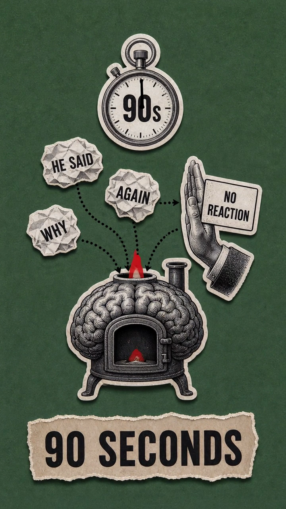 |
| 抽帧联络表 | 一眼检查元素是不是逐步入场，而不是一开始完整出现。 |  |

### 案例 01：逐秒抽帧

| 约略时间 | 画面状态 | 抽帧 |
| --- | --- | --- |
| 0s | 空面板 + `90 SECONDS`，没有主物件。 |  |
| 1s | 继续保持稀疏，确认不是从完整尾帧开始。 | 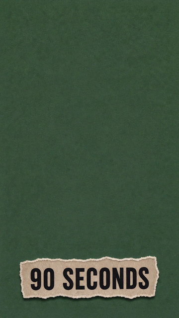 |
| 2s | 脑炉作为主暗喻入场。 | 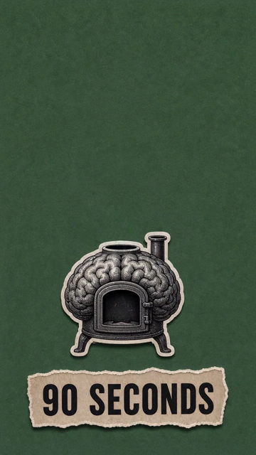 |
| 3s | 火苗、纸团和秒表开始出现。 | 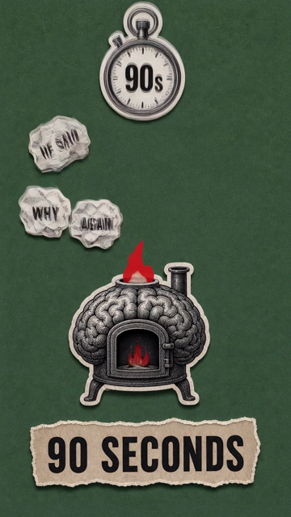 |
| 4s | 纸团标签和投喂路径稳定下来。 | 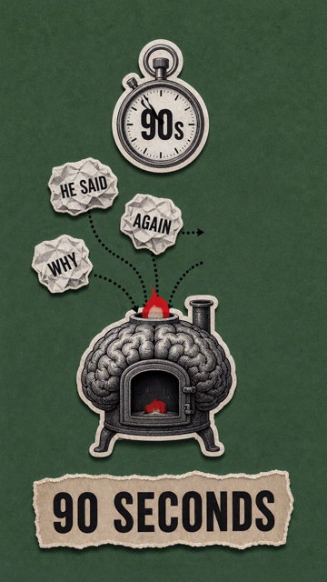 |
| 5s | `NO REACTION` 手势入场并阻挡投喂。 | 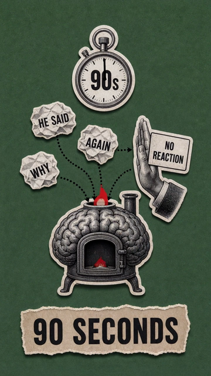 |

### 案例 02：真实视频预览

<div align="center">
  <video src="https://github.com/Mr-funny/satirical-editorial-collage-video/raw/refs/heads/main/assets/examples/emotion-reveal-case/emotion_reveal_visual_first.mp4" width="100%" controls></video>
</div>

| 素材 | 用途 | 预览 / 链接 |
| --- | --- | --- |
| 首帧图 | 空红色剧场纸面，只保留挂钩和阴影，不提前出现观点文字。 | 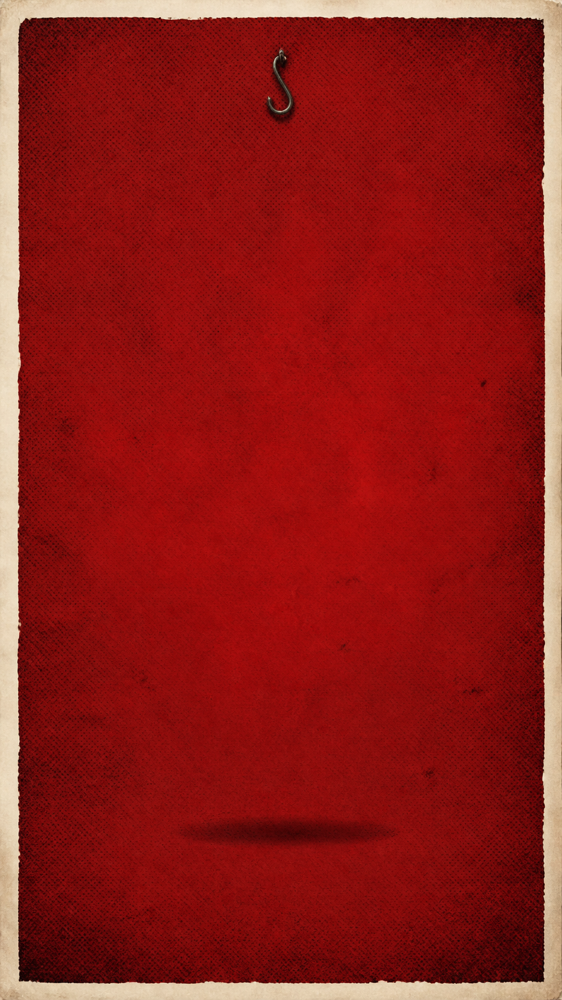 |
| 尾帧图 | 作为目标构图：愤怒面具被抬起，露出裂纹心脏、盾牌、冷汗和阴影。 | 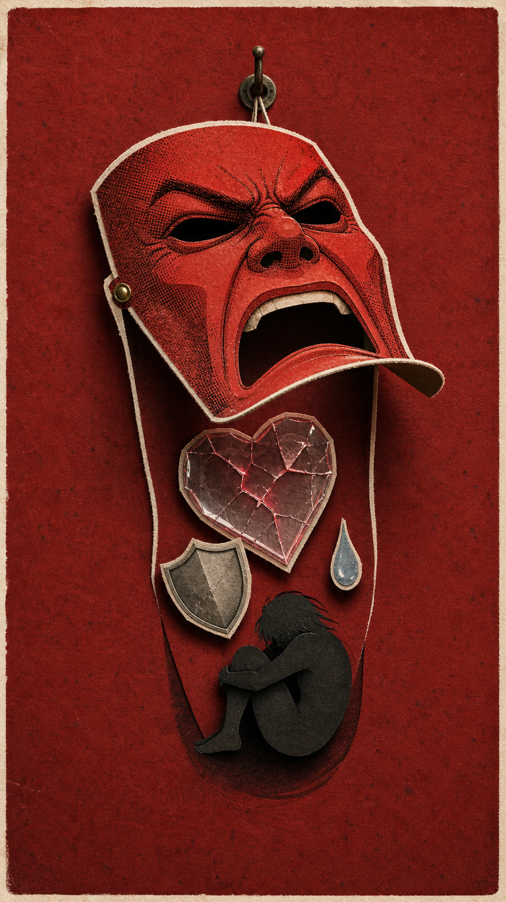 |
| 生成视频 | Grok 生成主体动作，组装时补入精确空首帧，保证开头稀疏。 | [emotion_reveal_visual_first.mp4](assets/examples/emotion-reveal-case/emotion_reveal_visual_first.mp4) |
| Grok 原片 | 未组装的 Grok 原始生成片段，用来对比模型自身的首帧倾向。 | [emotion_reveal_visual_first_grok_raw.mp4](assets/examples/emotion-reveal-case/emotion_reveal_visual_first_grok_raw.mp4) |
| 实际尾帧 | 从最终视频主视频流抽出的真实尾帧。 | 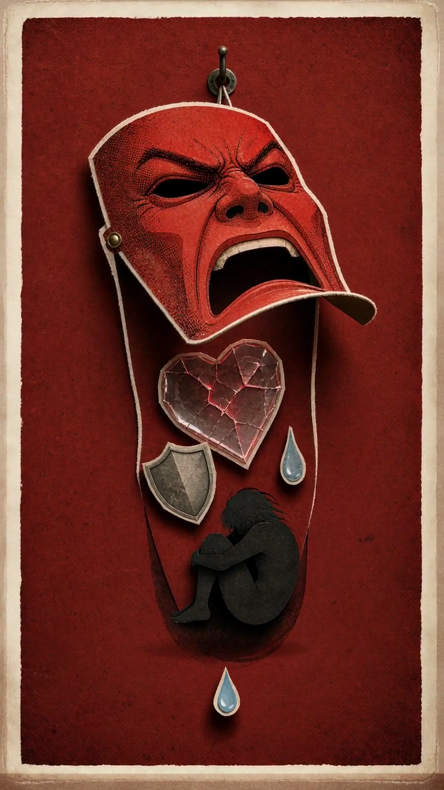 |
| 抽帧联络表 | 检查是否从空面板开始，再让面具和内部物件逐步出现。 | 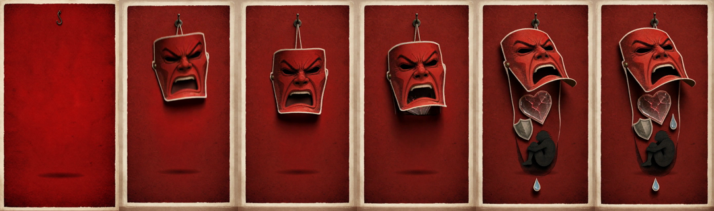 |

### 案例 03：真实视频预览

<div align="center">
  <video src="https://github.com/Mr-funny/satirical-editorial-collage-video/raw/refs/heads/main/assets/examples/control-game-case/control_game_visual_first.mp4" width="100%" controls></video>
</div>

| 素材 | 用途 | 预览 / 链接 |
| --- | --- | --- |
| 首帧图 | 空黄版，只留下左侧街机阴影和右侧逃离空间。 | 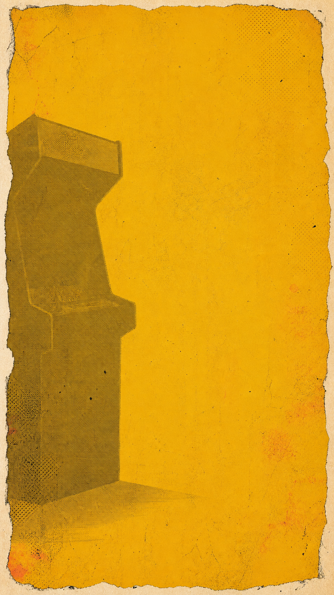 |
| 尾帧图 | 作为目标构图：街机伸出手柄和靶线，角色走出射程，操控线松掉。 | 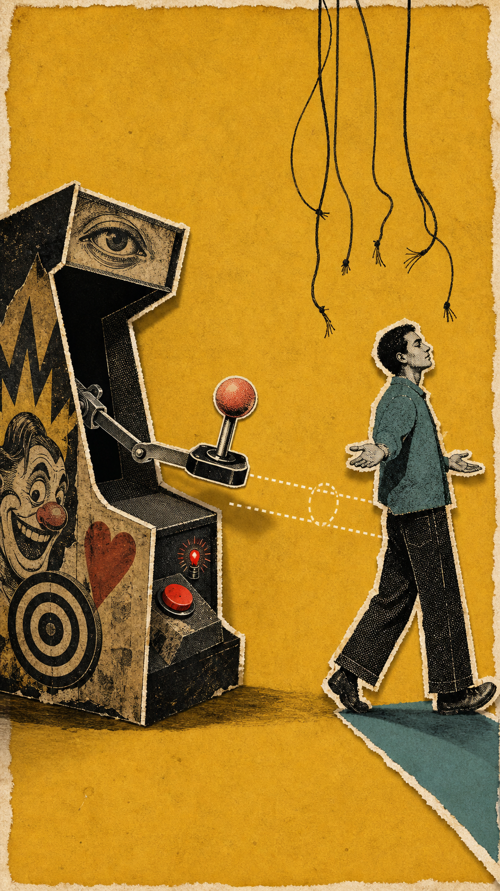 |
| 生成视频 | Grok 按首尾帧逻辑生成的真实视频。 | [control_game_visual_first.mp4](assets/examples/control-game-case/control_game_visual_first.mp4) |
| Grok 原片 | Grok 原始生成片段，当前最终版与原片一致。 | [control_game_visual_first_grok_raw.mp4](assets/examples/control-game-case/control_game_visual_first_grok_raw.mp4) |
| 实际尾帧 | 从生成视频主视频流抽出的真实尾帧。 | 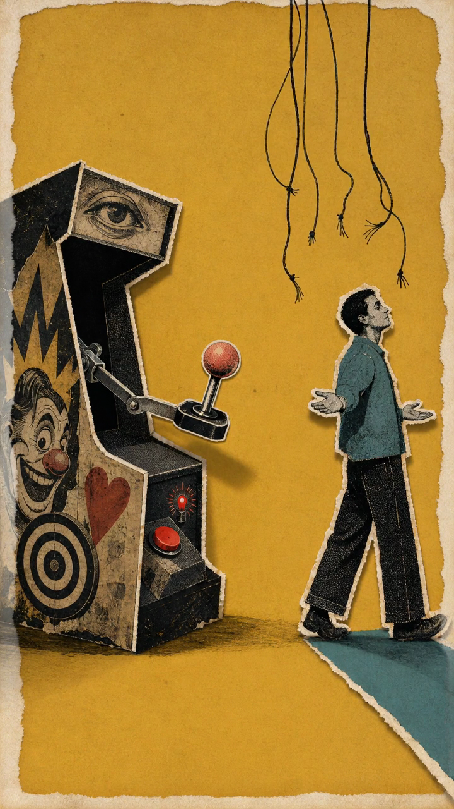 |
| 抽帧联络表 | 检查街机、靶线、人物和操控线是否按顺序出现。 | 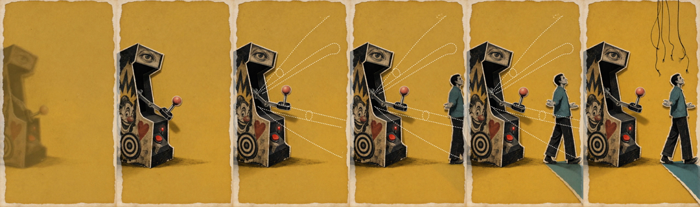 |

## 脚本用法

生成可复制的 prompt 包：

```bash
python3 scripts/build_satirical_editorial_collage_plan.py \
  --concept "anger is a small flame in a brain furnace, repetitive thoughts feed it, no reaction blocks the fuel" \
  --source-text "愤怒这种情绪，在你全身运作大概就是九十秒。但是你之所以一直愤怒，是因为你在不间断地想这件事情。" \
  --excerpt "愤怒这种情绪，在你全身运作大概就是九十秒。" \
  --emotion "anger" \
  --elements "90 SECONDS label,brain furnace sticker,red flame and crumpled thought fuel,NO REACTION hand" \
  --style "visual-first darkly comic satirical editorial collage animation, vintage halftone, thick white sticker outlines, tiny diegetic labels only" \
  --composition "locked vertical 9:16 camera, centered paper panel, large negative space at start" \
  --text "no large title text; optional tiny prop labels only" \
  --duration 6 \
  --out ./out/emotion-control-90s
```

输出包括：

- `shot_plan.json`
- `prompts.md`
- `assemble_manifest.json`
- `cli_commands.sh`
- `grok_prompts/shot_01.md`

## 风格关键词

可以用这些词控制整体气质：

- darkly comic satirical editorial paper-collage animation
- literary satirical allegory
- Kafkaesque bureaucratic allegory
- quiet menace, ironic symbolism
- vintage halftone, risograph texture
- thick white sticker outlines
- staged sticker assembly

## 开源协议

MIT License.
